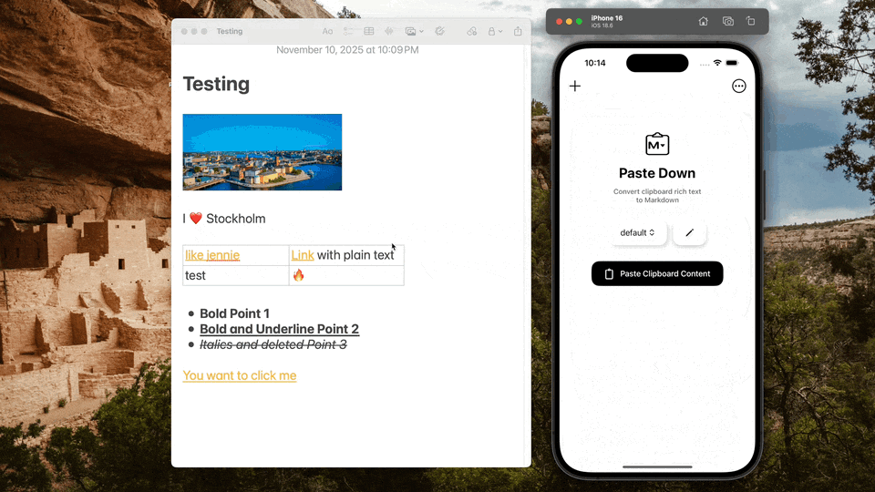
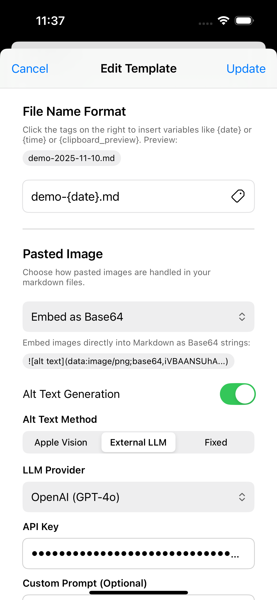
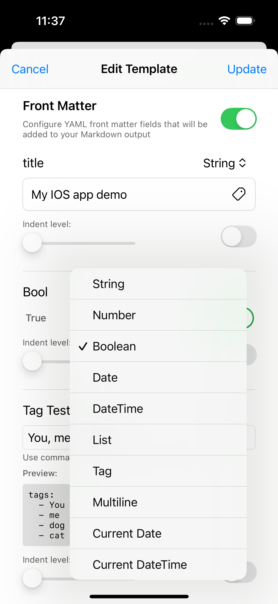
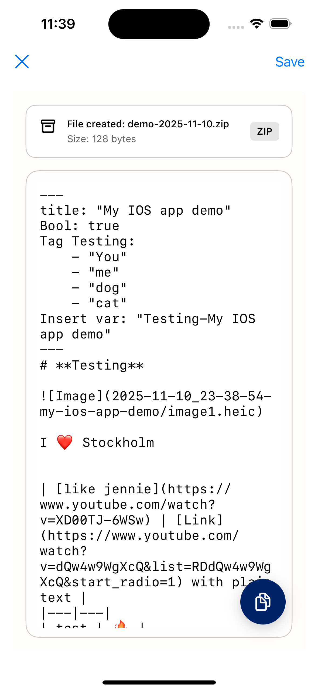

# Pastedown


> From your clipboard to markdown

Pastedown is an IOS app that converts rich text content from Apple Notes and other sources into clean, properly formatted Markdown.



[Demo Video](https://www.youtube.com/watch?v=XsYvLjk-zTA&feature=youtu.be)


## Why Pastedown?

Clipbroad data from Apple Notes uses a unique format that most rich text to Markdown converters struggle with. Pastedown was built specifically to handle this challenge, supporting:

- **Tables with Rich Content** - Including links, formatted text, and multi-line cells
- **Images** - Automatically generate alt text for images. User can choose between build-in apple vision on iphone or an exernal service using their own api key.
- **Lists** - Both ordered and unordered, including nested structures
- **Rich Formatting** - Bold, italic, headings, links, and code blocks
- **Customizable Output** - Define filenames, image paths, and YAML front matter with dynamic variables
- **Fliexable Variavble System** - Use build in variable such as `{data}`, `{date_time}` or `{clipboard_preview}` in file name, image path or front matter. You can also define front matter fields and refer their value in those settings. 
- **Multiple Date Formats for Front Matters Fields** - Included string, date or datetime (either user-assigned or automatically generated), multiple line and more. Uer can also comment out or indent a specific front matter field for better organization.

## Template

Create templates for different use cases! Customize the output Markdown filename, image handling and alt text generation.

### Filename & Image Handling

Configure how your files and images are named and organized:



**Filename Settings**

- Build in variable:
  - `{clipboard_preview}`: The first 20 characters in the clipboard
  - `{date}`: Time stamp in "yyyy-mm-dd" format
  - `{time}`: Time stamp in "yyyy-MM-dd'T'HH:mm:ss"
- Refer to a front matter field. For example if you have a field called "title," you can refer to it as `{title}`
- Example: `{date}-{title}.md`

**Image Handling Options**

- **Ignore Images**: Skip all images by replacing them with `<!-- Image ignored -->`.
- **Save to Local Folder**: Store images alongside your Markdown file.
  - **Custom Image Path**: Define specific folder structures using variables.
- **Embed Image as Base64 String**: Convert images to Base64 and embed them in the Markdown file.

For the `Save to Local Folder` and `Embed Image as Base64 String` options, users have three ways to provide alt text:

1. Set a fixed value (for example: ``).
2. Use the built-in Apple Vision to generate alt text.
3. Use an external API (user-provided key).

### Front Matter Configuration

Create rich YAML front matter with flexible data types and formatting:



**Data Type Support**

- Text — e.g., `"sample string"`
- Number — e.g., `12`
- Boolean — e.g., `true` or `false`
- Date — e.g., `yyyy-MM-dd`
- DateTime — e.g., `yyyy-MM-dd'T'HH:mm:ss`
- Tags — e.g.:
```
- "item1"
- "item2"
- "item3"
```
- List — e.g., `["item1", "item2", "item3"]`

**Advanced Options**
- **Comment Out Fields** — Add a `#` to comment out a field.
- **Indent Lists** — Indent lists up to three levels for nesting.
- **Variable Picker** — Quickly insert variables (built-in: `{clipboard}`, `{date}`, `{time}`). You can also reference other front matter fields as variables.

**Example Output:**
```yaml
---
title: "Meeting Notes"
date: 2025-11-11
tags: [work, planning]
draft: false
---
```



## Code Architecture

Pastedown follows the **MVVM (Model-View-ViewModel)** pattern for clean separation of concerns and maintainable code.

### Project Structure

```
pastedown-v1/
├── Models/                      # Data structures
│   ├── Template.swift           # Template configuration model
│   ├── FrontMatterField.swift   # Front matter field definition
│   ├── FrontMatterType.swift    # Front matter data types
│   ├── ImageHandling.swift      # Image processing options
│   └── AltTextTemplate.swift    # Alt text configuration
│
├── ViewModels/                  # Business logic and state management
│   ├── SettingsStore.swift      # Global settings with UserDefaults persistence
│   ├── RichTextProcessor.swift  # Core RTF to Markdown conversion engine
│   ├── ClipboardService.swift   # Clipboard data extraction (RTF, RTFD, HTML)
│   ├── ImageAnalyzer.swift      # Vision framework integration for alt text
│   └── TemplateSettingsViewModel.swift  # Template configuration logic
│
├── Views/                       # SwiftUI interface components
│   ├── ContentView.swift        # Main app container
│   ├── InitialViewWithSettings.swift    # Landing page with paste action
│   ├── Results.swift            # Markdown output display
│   ├── TemplateSettingsView.swift       # Template configuration UI
│   ├── SmartFrontMatterFieldView.swift  # Front matter field editor
│   └── VariablePickerView.swift         # Variable insertion helper
│
├── Utilities/                   # Helper functions and extensions
│   ├── MarkdownUtilities.swift  # Text formatting, links, headings, front matter
│   ├── TableUtilities.swift     # RTF table parsing and Markdown conversion
│   ├── ListUtilities.swift      # Ordered/unordered list processing
│   ├── ImageUtilities.swift     # Image extraction and processing
│   └── ShareSheet.swift         # iOS share sheet integration
│
└── DesignSystem/                # Reusable UI components
    ├── AppColors.swift          # Color palette
    ├── AppTypography.swift      # Text styles
    ├── AppButtonStyles.swift    # Button components
    └── AppCardStyles.swift      # Card layouts
```

### Key Components

**RichTextProcessor** (`ViewModels/RichTextProcessor.swift`)
- Main conversion engine from NSAttributedString to Markdown
- Two-phase table processing: structure extraction → content mapping
- Handles inline formatting, headings, lists, and code blocks

**ClipboardService** (`ViewModels/ClipboardService.swift`)
- Detects and extracts multiple clipboard formats (RTF, RTFD, HTML, plain text)
- Handles Apple Notes' unique RTFD format with embedded images

**TableUtilities** (`Utilities/TableUtilities.swift`)
- `RTFTableStructureParser`: Parses RTF table structure from raw data
- `AttributedStringTableContentExtractor`: Extracts formatted content
- Sophisticated placeholder-based merging for accurate conversion

**SettingsStore** (`ViewModels/SettingsStore.swift`)
- Centralized app configuration with automatic persistence
- Manages templates, image handling preferences, and user defaults

## Building & Running

```bash
# Build the project
xcodebuild -project pastedown-v1.xcodeproj -scheme pastedown-v1 build

# Run tests
xcodebuild test -project pastedown-v1.xcodeproj -scheme pastedown-v1 \
  -destination 'platform=iOS Simulator,name=iPhone 16'
```

Or simply open `pastedown-v1.xcodeproj` in Xcode and press `Cmd+R`.

## License

Copyright © 2025 Yu-shin. All rights reserved.
